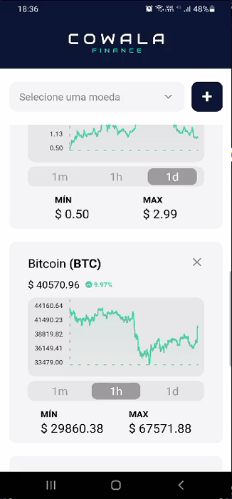

<p align="center">
  
</p>

<h1 align="center">Cowala Finance</h1>

<p align="center">Faça cotações de várias criptomoedas e permaneça atualizado sobre este grande mercado. </p>

<p align="center">
 <a href="#-sobre">Sobre</a> • 
 <a href="#-executando-o-happy">Como executar</a> • 
 <a href="#-tecnologias">Tecnologias</a> • 
 <a href="#-como-contribuir">Como contribuir</a> • 
 <a href="#-licença">Licença</a> 
</p>

---

## 💡 Sobre

A aplicação permite verificar a cotação de várias criptomoedas através da api [CoinCap](https://docs.coincap.io/).

---

## 💻 Executando o Cowala Finance

### Pré-requisitos

É necessário ter instalado na sua máquina para execução desse projeto:

- <a href="https://nodejs.org/en/"> NodeJS </a>;
- Gerenciador de pacotes Npm(já vem com o NodeJS) ou <a href="https://yarnpkg.com/getting-started/install"> Yarn </a>;
- <a href="https://pt-br.reactjs.org/"> React </a>;
- <a href="https://reactnative.dev/"> React Native </a>;
- <a href="https://docs.expo.io/get-started/installation/"> Expo </a>;
- <a href="https://styled-components.com/docs"> Styled-components </a>;

### ♊ Clonando o Repositório

```bash

$ git clone https://github.com/SilvioDiasJr/plantManager-React-Native

# entre na pasta do projeto

$ cd cowala-finance

```

### 💻 Executando projeto

Instale as dependências

```bash

$ yarn

# ou, caso use npm

$ npm install

```

Rode a aplicação

```bash

$ expo start

```

---

## 🛠️ Tecnologias

Principais tecnologias utilizadas no desenvolvimento do projeto.

- Typescript
- ReactJS ⚛️
- React Native
- Expo
- Styled-components

---

## ⚙️ Como contribuir

- Faça um fork desse repositório;
- Crie uma branch com a sua feature: `git checkout -b minha-feature`;
- Faça commit das suas alterações: `git commit -m 'feat: Minha nova feature'`;
- Faça push para a sua branch: `git push origin minha-feature`.

---

## 📝 Licença

Este projeto está sob licença [MIT](./LICENSE).

<p>Feito com 💙 por <a href="https://www.linkedin.com/in/silviodiasjr/">Silvio Dias</a></p>
